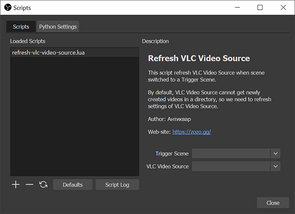

# Refresh VLC Video Source

### Lua script for Open Broadcaster Software (OBS)

This script refresh VLC Video Source when scene switched to a Trigger Scene.

By default, VLC Video Source cannot get newly created videos in a directory, so we need to refresh settings of VLC Video Source.

### Preview

